# CELSIUS V32 — Biophysical Process Graph

This graph represents the biophysical processes and interactions implemented in
the current CELSIUS V32 code. It is an implementation map, not an independent
conceptual specification.

```mermaid
flowchart TB
    %% Input data
    subgraph INPUTS[Database inputs and forcing]
        CLIM["Climate<br/>Tmin, Tmax, radiation, rain, ETP"]
        CO2["Atmospheric CO₂<br/>ListPAnnexes / CO2Yearly"]
        PLANT["Crop parameters<br/>Cultivars, PlantSpecies, StadePheno"]
        SOILPAR["Soil parameters<br/>Soil, Soil_layers, TypeSurfSol"]
        INITIAL["Initial state<br/>ParamIni"]
        MANAGEMENT["Management<br/>sowing, transplanting, irrigation,<br/>mineral and organic fertilization"]
        OPTIONS["Model switches<br/>OptionsModel, Codcc"]
    end

    %% Daily crop processes
    subgraph CROP[Crop processes]
        ESTAB["Establishment<br/>germination and emergence"]
        PHENO["Phenology<br/>thermal time and stages"]
        ROOT["Root growth<br/>rooting depth"]
        LAI["Leaf-area dynamics<br/>expansion, competition, senescence"]
        RAD["Radiation interception<br/>single or mixed canopy"]
        BIOM["Daily biomass growth<br/>radiation conversion"]
        YIELD["Yield formation<br/>grain number and harvest index"]
        NUPTAKE["Crop N uptake demand"]
    end

    %% Surface and water processes
    subgraph WATER[Surface and soil-water processes]
        MULCH["Mulch dynamics<br/>cover, decomposition, interception"]
        RUNOFF["Surface runoff"]
        WATERIN["Water reaching soil"]
        SOILEVAP["Soil evaporation"]
        TRANSP["Potential and actual transpiration<br/>mixed-canopy allocation"]
        SOILW["Soil water balance<br/>surface, germination, rooted,<br/>rootable and deep stores"]
        DRAIN["Drainage"]
        WSTRESS["Water-stress states<br/>emergence constraint, TurfacH,<br/>WSfactH, wilting signal"]
    end

    %% Nitrogen processes
    subgraph NITROGEN[Soil-nitrogen processes]
        NMIN["Soil organic-N mineralization"]
        RESN["Applied-residue mineralization<br/>(unfinished branch)"]
        NFERT["Mineral and organic N inputs"]
        NPOOL["Available mineral-N pool"]
        DENIT["Denitrification"]
        NLEACH["N loss by drainage"]
        NSTRESS["Crop N-stress factors<br/>NRF / NRF_bio"]
    end

    %% Outputs
    subgraph OUTPUTS[Main simulated outputs]
        OUTCROP["LAI, biomass, grain yield,<br/>phenological dates, root depth"]
        OUTWATER["Evaporation, transpiration,<br/>runoff, drainage, water stocks"]
        OUTN["Available N, crop N uptake,<br/>denitrification, N leaching"]
    end

    %% Input connections
    CLIM --> PHENO
    CLIM --> RAD
    CLIM --> MULCH
    CLIM --> SOILEVAP
    CLIM --> TRANSP
    CLIM --> SOILW
    CLIM --> NMIN
    CLIM --> DENIT
    CO2 -->|"CO2fact"| BIOM
    PLANT --> ESTAB
    PLANT --> PHENO
    PLANT --> ROOT
    PLANT --> LAI
    PLANT --> BIOM
    PLANT --> YIELD
    SOILPAR --> SOILW
    SOILPAR --> NMIN
    INITIAL --> SOILW
    INITIAL --> NPOOL
    MANAGEMENT --> ESTAB
    MANAGEMENT -->|"irrigation"| WATERIN
    MANAGEMENT --> NFERT
    OPTIONS -.->|"activates process branches"| ESTAB
    OPTIONS -.-> LAI
    OPTIONS -.-> BIOM
    OPTIONS -.-> NMIN
    OPTIONS -.-> NSTRESS

    %% Crop sequence and interactions
    ESTAB --> PHENO
    ESTAB --> LAI
    PHENO --> ROOT
    PHENO --> LAI
    PHENO --> YIELD
    ROOT -->|"root-zone geometry"| SOILW
    SOILW -->|"wet zone below roots"| ROOT
    LAI --> RAD
    LAI --> TRANSP
    LAI -->|"canopy interception context"| MULCH
    RAD --> BIOM
    BIOM --> YIELD
    BIOM --> NUPTAKE

    %% Surface-water interactions
    MANAGEMENT -->|"residue and surface management"| MULCH
    MULCH -->|"intercepted water"| WATERIN
    MULCH --> RUNOFF
    CLIM -->|"rain"| WATERIN
    RUNOFF -->|"removes water"| WATERIN
    WATERIN --> SOILW
    SOILW -->|"evaporative loss"| SOILEVAP
    SOILW -->|"root water supply"| TRANSP
    SOILW --> DRAIN
    SOILW --> WSTRESS
    WSTRESS -->|"emergence gate"| ESTAB
    WSTRESS -->|"leaf expansion and senescence"| LAI
    WSTRESS -->|"WSfactH"| BIOM
    WSTRESS -->|"actual transpiration"| TRANSP
    WSTRESS -->|"severe drought"| PHENO

    %% Nitrogen interactions
    NFERT --> NPOOL
    NMIN --> NPOOL
    RESN --> NPOOL
    NPOOL --> NUPTAKE
    NUPTAKE -->|"removes N"| NPOOL
    NPOOL --> NSTRESS
    NSTRESS -->|"Turfact / NRF"| LAI
    NSTRESS -->|"NRF_bio"| BIOM
    NPOOL --> DENIT
    DENIT -->|"removes N"| NPOOL
    DRAIN --> NLEACH
    NPOOL --> NLEACH
    NLEACH -->|"removes N"| NPOOL

    %% Outputs
    PHENO --> OUTCROP
    ROOT --> OUTCROP
    LAI --> OUTCROP
    BIOM --> OUTCROP
    YIELD --> OUTCROP
    SOILEVAP --> OUTWATER
    TRANSP --> OUTWATER
    RUNOFF --> OUTWATER
    DRAIN --> OUTWATER
    SOILW --> OUTWATER
    NPOOL --> OUTN
    NUPTAKE --> OUTN
    DENIT --> OUTN
    NLEACH --> OUTN

    %% Styling
    classDef input fill:#e8f1fb,stroke:#31688e,color:#13293d;
    classDef crop fill:#e8f5e9,stroke:#2e7d32,color:#17351a;
    classDef water fill:#e0f7fa,stroke:#00838f,color:#12383c;
    classDef nitrogen fill:#fff3e0,stroke:#ef6c00,color:#492600;
    classDef output fill:#f3e5f5,stroke:#7b1fa2,color:#32103d;
    class CLIM,CO2,PLANT,SOILPAR,INITIAL,MANAGEMENT,OPTIONS input;
    class ESTAB,PHENO,ROOT,LAI,RAD,BIOM,YIELD,NUPTAKE crop;
    class MULCH,RUNOFF,WATERIN,SOILEVAP,TRANSP,SOILW,DRAIN,WSTRESS water;
    class NMIN,RESN,NFERT,NPOOL,DENIT,NLEACH,NSTRESS nitrogen;
    class OUTCROP,OUTWATER,OUTN output;
```

## Reading the graph

- Solid arrows represent implemented transfers or direct process dependencies.
- Dashed arrows represent switches that activate or deactivate model branches.
- Feedback loops are intentional. For example, root depth determines the
  root-zone water balance, while water below the root front limits root growth.
- CO₂ has one direct biophysical connection: `CO2fact` multiplies daily biomass
  production. Its effects on N uptake and yield are downstream consequences of
  biomass growth.
- `CO2Yearly` provides a global annual concentration, because it is indexed by
  year and not by `idDclim`. The station value in `ListPAnnexes.CO2c` is the
  fallback.
- Applied-residue mineralization is shown because the branch exists and uses
  `ListResidus`, but the inherited implementation marks it as unfinished.

## Main implementation owners

| Process group | Main implementation |
|---|---|
| Simulation order and coupling | `SimulationControlClass.vb` |
| Climate and atmospheric CO₂ | `DataClimClass.vb` |
| Phenology, LAI, roots, biomass and yield | `PLanteClass.vb` |
| Mixed-canopy aggregation and transpiration | `CultureClass.vb` |
| Mulch, interception and runoff | `MulchClass.vb` |
| Soil water and nitrogen balances | `SolClass.vb` |
| Irrigation and fertilization calendars | `GestionTechniqueClass.vb`, `IrrigClass.vb`, `FertiMinClass.vb`, `FertiOrgaClass.vb` |

The companion documents provide the process equations and the detailed model
execution order:

- [CELSIUS V32 model overview](CELSIUS_Model_Overview.md)
- [CELSIUS V32 process equations](CELSIUS_Process_Equations.md)
- [CELSIUS V32 HTML manual](CELSIUS_Manual.html)
